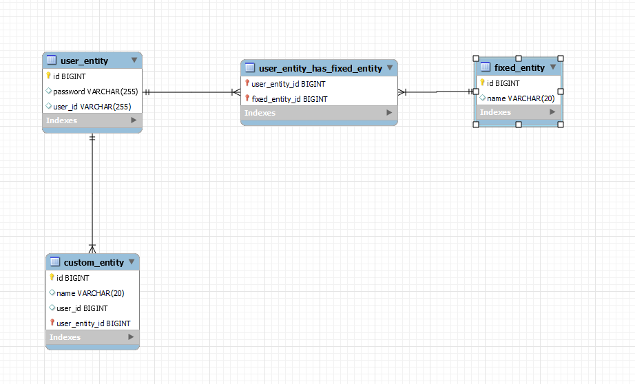
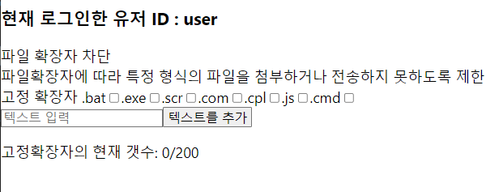
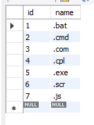
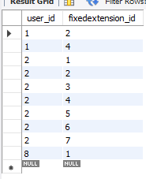
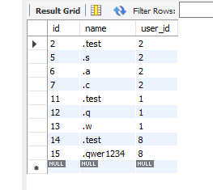
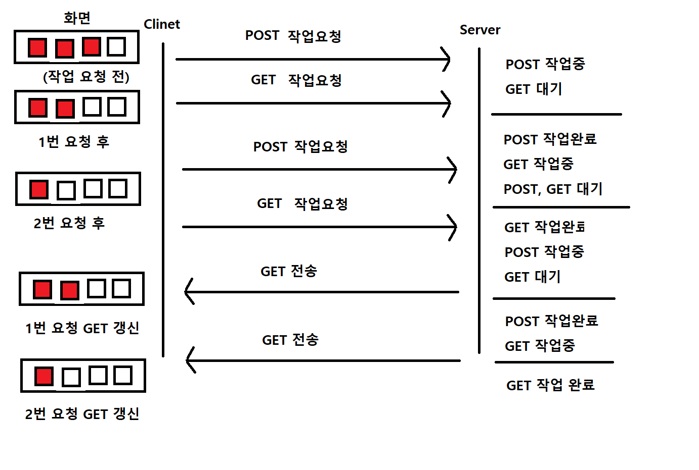

<h1 align="center">Flow 서버 재발자 과제 💻 </h1>
## 🎬 [데모 사이트](http://13.125.220.212/) <- 클릭하면 이동됩니다!
    
## 🛠️ 기술 스택

**Back_End**<br/>


**Front_End** <br/>


## 🤹🏻 기술 스택 선정 이유

**Back_End**

- SpringBoot : SpringBoot 라이브러리를 사용해 백엔드 개발하였습니다
- Springsecurity : User의 Password를 암호화 하기 위해서 사용하였습니다
- Java Persisitence API : Java 코드로 DB를 제어 사용하였습니다
- Junit : 만들어진 Controller를 테스트 하기위해 사용하였습니다
- mysql : User의 확장자 정보를 저장 하기 위해서 사용하였습니다 <br/><br/>

**Back_End**

- React.js : 비동기 처리와 랜더링의 편의성을 위해 사용
- Axios : 비동기 요청을 위해 사용

## 📌 파일 확장자 차단 프로젝트 목표

```sh
1. 고정 확장자의 check or uncheck를 할 때 DB에 저장이 되도록 한다
(새로고침시 유지)

2. 커스텀 확장자는 추가시 영역에 표시가 되며 DB에 저장되며
커스텀 확장자 옆 X클릭시 화면에서 삭제되며 DB에 삭제 된다

3. 커스텀 확장자는 최대 200개까지 추가 가능
```

## 📄 ERD

<center>
    
</center>

## 🔍 Overview

### 1. 고정 확장자 데이터 저장

1. 고정확장자 DB에 있는 데이터로 화면이 만들어짐니다 - BackEnd 실행시 Seed값 생성
<center>
    
</center>

2. User가 체크를 하거나 비활성화 하면 상태를 저장합니다
3. 서버에 체크된 고정확장자의 이름을 데이터를 저장 or 삭제 합니다
4. 저장 or 삭제가 성공하면 수정된 데이터를 요청해 로컬스토리지에 담습니다 - 새로고침시 데이터가 남아 있도록하기 위해서 사용합니다 - 새로고침시 화면의 랜더링 시간을 줄이기 위해서 사용합니다
<center>
    
    
    
</center>

### 2. 커스텀 확장자 데이터 저장

1. 커스텀 확장자 DB에 데이터가 있으면 커스텀 목록이 화면이 만들어집니다
2. User가 입력창에 데이터를 입력하면 소문자로 저장됩니다<br/>
   (작업 순서를 고정 확장자와 동일합니다)
3. X 표시를 누르면 데이터가 삭제가 됩니다
<center>
    
    

</center>

### _고려사항_

- 금지단어 설정

  - 운영체제의 따라 파일에 들어갈 수 없는 글자들이 있어서 <br>
    "<", ">", ":", '"', "/", "\\", "|", "?", "\*", " "<br>
    입력 금지 설정 하였습니다

- 최대 길이 설정

  - 데이터 입력시 20글자 이상 입력이 되지 않도록 <br>
    글자 입력시 입력된 글자의 길이를 항상 확인하여 <br>
    20글자가 이상 입력되면 입력이 더 이상 안되도록 설정

- 확장자 소문자 통일

  - 확장자는 대소문자를 구분하지 않음으로 소문자로 통일

- 랜더링 순서

  - 처음 개발했던 작업의 순서는

  1. 저장 or 삭제 요청
  2. 작업성공시 수정된 데이터 요청
  3. 요청 받은 데이터 프론트 화면에 랜더링<br>
     이 순서로 진행을 하게 되니<br>
     로컬환경에서는 서버의 처리 속도가 빨라 바로바로 랜더링이 됐지만<br>
     AWS 프리티어에 올렸을때 Server 성능으로 인해 2~3초 화면 변화가 없어<br>
     문제가 생긴 것처럼 보이는 현상 발생하였습니다 <br><br>

     \*해결방법

  - 위의 1. 2. 3. 작업전에 먼저 프론트에서 데이터를 수정하여 화면에 랜더링 되도록 해결
  - 추가적으로 3번 작업 같은 경우 작업요청 순서에 따라 랜더링이 원치 않게 진행되어<br>
  데이터를 요청 받으면 로컬스토리지에 반영이 되도록 하여 랜더링이 실행 되지 않도록 하였습니다
  <center>
  
  </center>

- 커스텀 확장자 입력시 갯수 확인
  - 커스텀 확장자가 200개 이상이 될 경우 저장 요청이 되지 않도록 설정
- 커스텀 확장자 이름 마침표로 시작하는지 확인
  - 파일 확장자는 마침표로 파일 구분을 하기 때문에<br>
    마침표가 없으면 안되게 적용하였습니다<br>
  - 마침표로 시작하지 않으면 저장이 않되니 안되니 공백시작도 관리가 되었습니다<br>
- 커스텀 확장자의 고정 확장자, 커스텀 확장자 중복 확인
  - 커스텀 확장자 저장시
    고정 확장자 목록 확인 후 커스텀 확장자 목록을 확인 후
    이름이 없으면 저장 하도록 설정
